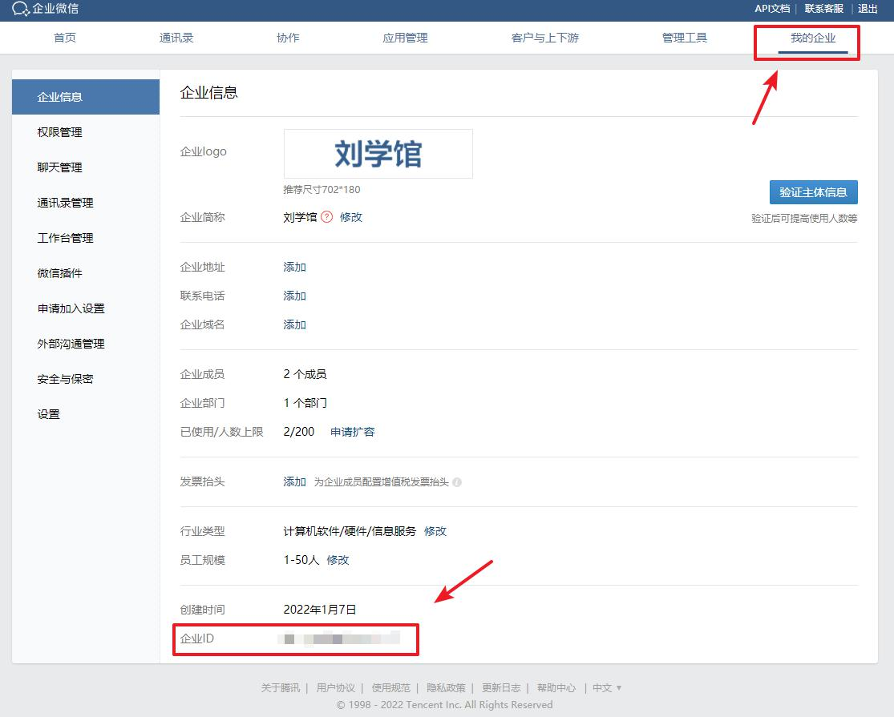
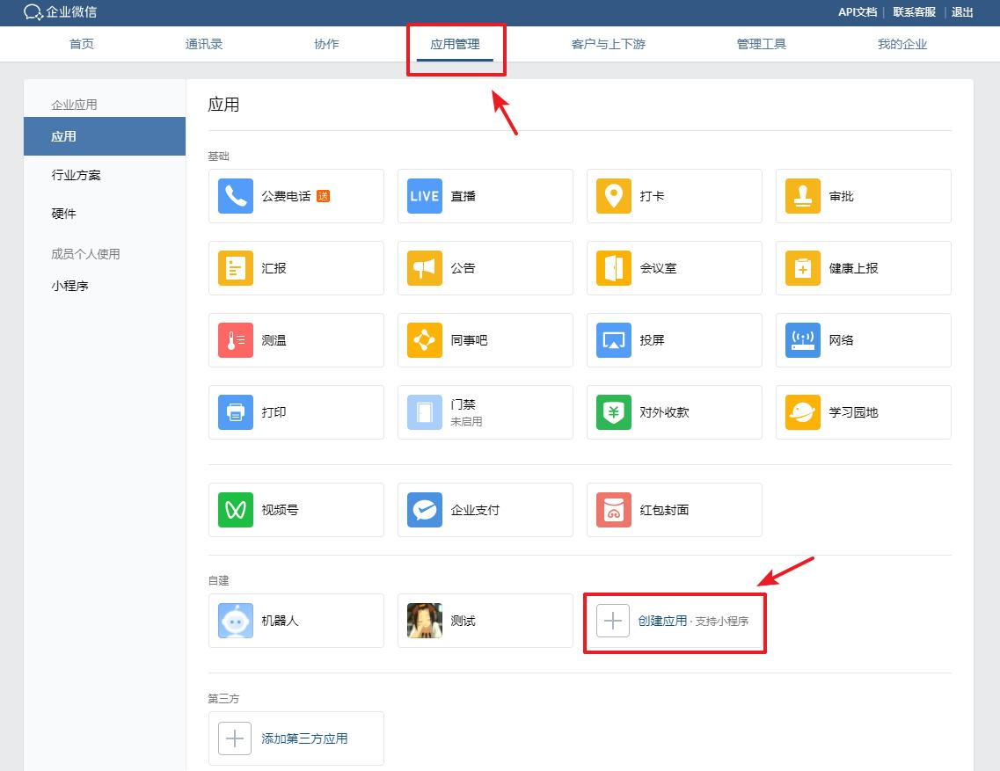
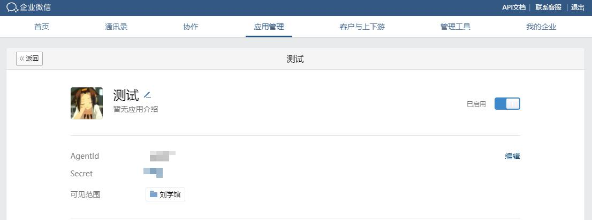
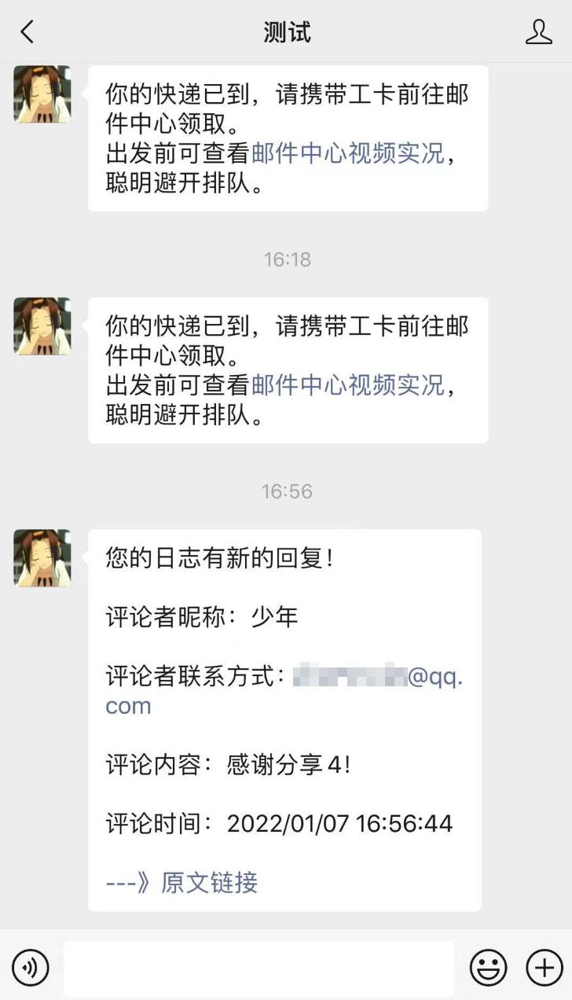

# 企业微信消息推送api

利用企业微信的Api，实现推送消息到微信上

是一款类似于server酱Turbo版的「程序员」和「服务器」之间的通信软件

注：不需要使用到企业微信，只需要获取 `cropid` `secret` `agentid`三个值即可

## 使用方式

1.在`WxWork_Push.java`文件中填入 `cropid` `secret` `agentid`三个值，用GET参数请求

2.把`WxWork_Push.java`引入到您的web项目，jsp的话使用javabean等方式，直接调用`postMsg("消息内容")`函数发送post请求，如：

```java
postMsg("你的快递已到，请携带工卡前往邮件中心领取。\n出发前可查看<a href=\"http://work.weixin.qq.com\">邮件中心视频实况</a>，聪明避开排队。");
```

## 返回实例

```java
{"errcode":0,
 "errmsg":"ok",
 "msgid":"****************"}
```

### 注意

文档使用到`fastjson-1.2.79.jar`包，需要导入

## 参数获取

`corpid`获取

登陆企业微信，点击我的企业，最下面就是企业ID



`secret` 和 `agentid` 获取

点击应用管理，点击创建应用，自行填写资料，创建好后即可看到






## 推送样式




by：[刘学馆](http://www.sexy0769.com)